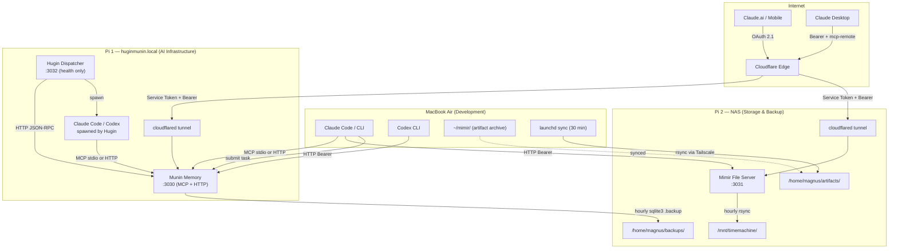
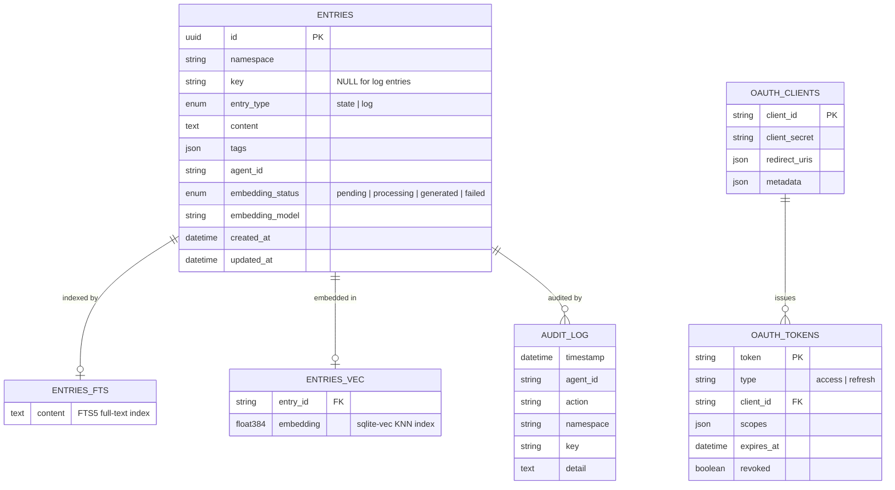
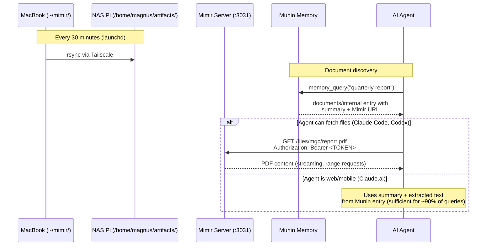
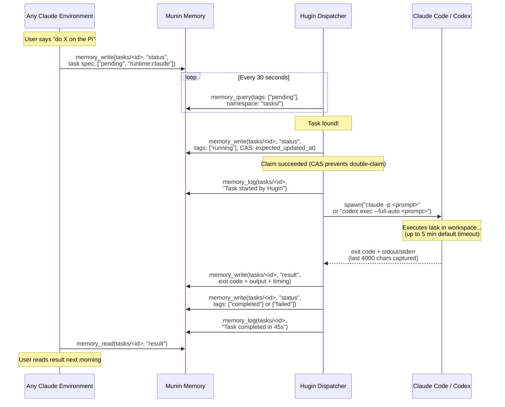

# The Jarvis System — Architecture Guide

> Internal reference document for the Jarvis personal AI infrastructure.
> Last updated: 2026-03-14.

---

## The Jarvis System

Jarvis is a personal AI infrastructure built on two Raspberry Pi 5 units, a MacBook, and a set of cloud AI services. It gives Claude (and other AI runtimes) persistent memory, file access, and the ability to execute tasks autonomously — all running on hardware owned and controlled by its operator.

### Why it exists

Every conversation with Claude starts from zero. There is no memory between sessions, no access to personal files, and no way to say "do this while I sleep." Jarvis solves these three problems:

1. **Memory** — Munin gives Claude persistent, searchable memory across every environment (desktop, mobile, web, CLI).
2. **Files** — Mimir makes personal documents available to agents over HTTPS, with summaries cached in Munin for environments that can't fetch files directly.
3. **Autonomy** — Hugin lets any Claude session submit a task that gets executed on the Pi, with results written back to memory.

### Design philosophy

Three principles guide every decision:

- **Sovereignty** — All data lives on Magnus's hardware. The Pis hold the database, the files, and the backups. Cloud AI services are stateless tools; they process but don't store.
- **Privacy** — Writes to memory are scanned for secrets before storage. Auth is required at every layer. Sensitive documents get summaries in Munin but full text stays on the Pi.
- **Simplicity** — Each service is a single-purpose Node.js/TypeScript application. No frameworks beyond Express for HTTP. No ORMs. No Kubernetes. SQLite for storage. systemd for process management. The core logic of each service lives in a single `src/index.ts` file, though operational behavior also depends on systemd units, deploy scripts, and transport clients.

---

## System Topology

The system spans two Raspberry Pi 5 units and a MacBook Air, connected via Tailscale (private mesh VPN) and exposed to cloud services through Cloudflare Tunnels.



### Hardware

Both Pis are Raspberry Pi 5 units in Flirc passive-cooling aluminum cases. They run on the same local network and are also connected via Tailscale for reliable cross-Pi communication regardless of network configuration.

| Unit | Hostname | Role | Key Services |
|------|----------|------|-------------|
| Pi 1 | `huginmunin.local` | AI infrastructure | Munin (memory), Hugin (dispatcher) |
| Pi 2 | NAS | Storage & backup | Mimir (files), Samba, Time Machine |

### Network model

- **Local services** bind to `127.0.0.1` only — never exposed on the LAN directly.
- **Cloudflare Tunnels** provide HTTPS ingress from the internet to each Pi, with edge-layer authentication.
- **Tailscale** provides encrypted Pi-to-Pi and laptop-to-Pi communication for rsync, SSH, and backups.

---

## Munin — Memory

Munin is the brain of the system. It is an MCP (Model Context Protocol) server that gives Claude persistent, searchable memory across every environment — desktop app, mobile, web, and CLI.

### Architecture

- **Runtime:** Node.js 20+, TypeScript (strict mode)
- **Database:** SQLite via `better-sqlite3`, with FTS5 full-text search and `sqlite-vec` for vector search
- **Protocol:** MCP over stdio (local) or stateless Streamable HTTP (network)
- **Auth:** Dual — legacy Bearer token for CLI/Desktop + OAuth 2.1 for web/mobile
- **Deployment:** systemd on Pi 1, exposed via Cloudflare Tunnel

### Data model

Munin stores two fundamental types of entry in a single `entries` table:



**State entries** are mutable key-value pairs, identified by `namespace + key`. They represent current truth — a project's status, a person's contact info, a decision record. Writing to the same namespace+key overwrites the previous value.

**Log entries** are append-only, timestamped, and have no key. They represent chronological history — decisions made, milestones reached, events recorded. Log entries are never modified after creation.

**Namespaces** are hierarchical strings separated by `/` (e.g., `projects/munin-memory`, `people/magnus`, `documents/internal`). They are created implicitly on first write.

### Search

Munin supports three search modes through `memory_query`:

| Mode | Mechanism | Best for |
|------|-----------|----------|
| **Lexical** | FTS5 keyword search | Exact terms, known identifiers |
| **Semantic** | sqlite-vec KNN over 384-dim embeddings | Conceptual similarity, natural language |
| **Hybrid** | Reciprocal Rank Fusion (RRF) of both | General queries (default) |

Embeddings are generated asynchronously by a background worker using Transformers.js with the `all-MiniLM-L6-v2` model. Writes are never blocked by embedding generation. A circuit breaker trips after repeated failures, gracefully degrading all search to lexical mode.

### MCP tools

Munin exposes eight tools via the Model Context Protocol:

| Tool | Purpose |
|------|---------|
| `memory_orient` | Start-of-conversation orientation: conventions, computed project dashboard, namespace overview, maintenance suggestions |
| `memory_write` | Store or update a state entry. Supports compare-and-swap for concurrent safety |
| `memory_read` | Retrieve a specific state entry by namespace + key |
| `memory_read_batch` | Retrieve multiple entries in one call |
| `memory_get` | Retrieve any entry (state or log) by UUID |
| `memory_query` | Search memories with lexical, semantic, or hybrid modes |
| `memory_log` | Append an immutable log entry |
| `memory_delete` | Delete with token-based two-step confirmation |

### Computed dashboard

`memory_orient` dynamically computes a project dashboard from status entries in `projects/*` and `clients/*` namespaces. Entries are grouped by lifecycle tag (`active`, `blocked`, `completed`, `stopped`, `maintenance`, `archived`), with maintenance suggestions surfaced for stale or misconfigured entries. No manual workbench maintenance is needed.

### How agents connect

Munin supports four connection patterns, covering every Claude environment:

| Environment | Transport | Auth |
|-------------|-----------|------|
| Claude Code (local) | MCP stdio | None (process-level) |
| Claude Code (remote) | MCP HTTP | Bearer token + edge service token |
| Claude Desktop | MCP HTTP via `mcp-remote` bridge | Bearer token + edge service token |
| Claude.ai / Claude Mobile | MCP HTTP with OAuth 2.1 | Dynamic client registration, PKCE |

The HTTP transport runs in **stateless mode**: each POST to `/mcp` creates a fresh MCP server and transport, processes the request, and tears down. This eliminates session management complexity and the session-drop bugs that plagued the earlier stateful implementation.

---

## Mimir — File Archive

Mimir is a self-hosted authenticated file server. It makes personal documents — PDFs, presentations, images, markdown files — available to AI agents over HTTPS.

### Architecture

- **Runtime:** Node.js 20+, TypeScript (strict mode)
- **Framework:** Express (single ~250-line file)
- **Auth:** Bearer token with timing-safe comparison
- **Deployment:** systemd on Pi 2 (NAS), exposed via Cloudflare Tunnel
- **Storage:** SD card on NAS Pi, backed up hourly to external disk

### Endpoints

| Endpoint | Auth | Purpose |
|----------|------|---------|
| `GET /health` | None | Health check |
| `GET /files/{path}` | Bearer | Serve file from archive, with range request support |
| `GET /list/{path}` | Bearer | JSON directory listing (dotfiles hidden) |

### File flow

Files originate on the MacBook, sync to the NAS Pi, and are discovered by agents through Munin:



### Indexing pipeline

Documents are indexed into Munin under `documents/*` namespaces using a `/index-artifacts` skill. Each indexed entry contains:

- **Source URL** — the Mimir HTTPS URL for fetching the full file
- **Local path** — laptop path for reference
- **Metadata** — type, size, date, SHA-256 hash
- **Summary** — 2-5 sentence description
- **Key points** — extracted insights
- **Extracted text** — first ~10,000 characters

This two-layer model means Munin serves as the **discovery layer** while Mimir serves as the **content layer**. Agents query Munin to find relevant documents, then optionally fetch full files from Mimir when the summary isn't sufficient.

### Backup

Mimir artifacts are backed up hourly from the SD card to the external disk on the same Pi (`/mnt/timemachine/backups/mimir/`), separate from the Time Machine backup volume.

---

## Hugin — Task Dispatch

Hugin is the system's hands. It polls Munin for pending tasks, spawns AI runtimes to execute them, and writes results back. Named after Odin's raven of thought — the one that flies out and returns with knowledge.

### Architecture

- **Runtime:** Node.js 20+, TypeScript (strict mode)
- **Framework:** Express (health endpoint only)
- **Deployment:** systemd on Pi 1, co-located with Munin
- **Integration:** Munin HTTP API via JSON-RPC 2.0

### The poll-claim-execute-report lifecycle



### Task schema

Any Claude environment can submit a task by writing to Munin:

```markdown
Namespace: tasks/<task-id>
Key: status
Tags: ["pending", "runtime:claude"]

## Task: <title>

- **Runtime:** claude | codex
- **Working dir:** /home/magnus/workspace
- **Timeout:** 300000
- **Submitted by:** claude-desktop
- **Submitted at:** 2026-03-14T10:00:00Z

### Prompt
<the actual prompt for the AI runtime>
```

Hugin parses this structured markdown, extracts the runtime, working directory, timeout, and prompt, then spawns the appropriate CLI tool.

### Execution model

- **One task at a time** — no parallelism. Simplicity over throughput.
- **Compare-and-swap claiming** — uses Munin's `expected_updated_at` to prevent double-claiming if multiple dispatchers ever run.
- **Output capture** — ring buffer keeps the last 4,000 characters of combined stdout/stderr.
- **Timeout handling** — SIGTERM after the configured timeout, SIGKILL after an additional 10 seconds.
- **Stale task recovery** — on startup, Hugin scans for tasks in `running` state. A task is considered stale if the elapsed time since its `Submitted at` timestamp exceeds 2x its configured timeout. Stale tasks are marked as `failed`. Note: this measures time since submission, not time since execution started — a task that sat pending for a long time before being claimed could be marked stale immediately after a restart. This is a known simplification.
- **Graceful shutdown** — SIGTERM is forwarded to any running child process, with a 30-second grace period before SIGKILL.

### systemd sandboxing

Hugin runs with `ProtectSystem=strict`, `NoNewPrivileges=true`, and write access only to its own directory, the workspace, and `/tmp`. It depends on `munin-memory.service` and `network-online.target`.

---

## Security Model

Every network-exposed service in Jarvis uses the same two-layer authentication pattern:

### Layer 1: Edge authentication

A reverse proxy (Cloudflare Access) sits in front of every public endpoint. Requests must present a valid service token to pass the edge. This layer:

- Terminates TLS
- Authenticates the calling service or user
- Blocks all unauthenticated traffic before it reaches the Pi
- Provides DDoS protection and rate limiting at the edge

### Layer 2: Origin authentication

Each service requires its own Bearer token at the origin, verified with timing-safe comparison. Even if the edge layer were bypassed, the origin rejects unauthenticated requests. This layer:

- Validates Bearer tokens (Munin, Mimir) or OAuth 2.1 access tokens (Munin)
- Applies per-service rate limiting
- Enforces DNS rebinding protection via allowed-host validation
- Returns security headers (CSP, X-Frame-Options, X-Content-Type-Options, X-Robots-Tag)

### Path-based policies

Not all endpoints need the same auth. OAuth discovery endpoints (`/.well-known/*`), token exchange (`/token`), and health checks (`/health`) are public at the edge. The MCP endpoint and file-serving endpoints require full two-layer auth.

### Application hardening

Beyond authentication, each service includes:

- **Secret scanning** — Munin rejects writes containing API keys, tokens, private keys, or passwords (pattern-matched before storage)
- **Input validation** — strict regex for namespaces, keys, and tags; content size limits
- **Path traversal prevention** — Mimir resolves and jails all file paths to the configured root directory
- **systemd sandboxing** — `ProtectSystem=strict`, `NoNewPrivileges=true`, read-only filesystem except for explicitly allowed paths
- **Database permissions** — Munin's SQLite file is created with `0600` (owner read/write only)

### Backup strategy

| What | Frequency | Mechanism | Destination | Retention |
|------|-----------|-----------|-------------|-----------|
| Munin SQLite DB | Hourly | `sqlite3 .backup` + integrity check + rsync | NAS Pi | 7 days |
| Mimir artifacts | Hourly | rsync to external disk | NAS external disk | Ongoing |
| MacBook | Continuous | Time Machine via Samba to NAS | NAS external disk (1.5 TB) |  Standard TM |

The Munin backup uses `sqlite3 .backup` (WAL-safe) rather than file copy, followed by `PRAGMA integrity_check` before transfer. The systemd timer runs with a random delay to avoid thundering-herd effects.

---

## Cross-Cutting Concerns

### The two-layer state model

A recurring pattern across Jarvis is the separation of **execution detail** and **cross-environment summary**:

- **Local files** hold the full detail — source code, documents, build artifacts. These live on disk and are accessed directly by the runtime executing the work.
- **Munin entries** hold the summary — project status, document summaries, task results. These are accessible from any environment, including mobile.

This isn't just a convenience pattern; it's a necessity. Claude.ai and Claude Mobile can access Munin (via MCP) but cannot read local files or execute commands. By maintaining summaries in Munin, every Claude environment stays informed even if it can't directly interact with the filesystem.

### The debate/review process

Architecture decisions in Jarvis are stress-tested through a structured debate process between AI systems:

1. **Claude** (Opus) drafts the proposal or design
2. **Codex** (GPT) provides adversarial review — finding blind spots, challenging assumptions, proposing alternatives
3. The debate produces a **resolution document** capturing what changed and why
4. Key amendments are recorded in the relevant `CLAUDE.md`

This process produced concrete improvements to Munin's implementation: UPSERT semantics, transaction wrapping, composite indexes, RRF over-fetch ratios, and the buffer conversion fix for embeddings. It also surfaced the sovereignty tension — that sending data to cloud AI services contradicts a pure self-hosting claim — which led to the Sovereign AI Compliance project.

### Deployment patterns

All three services follow the same deployment model:

1. **Build locally** — `npm run build` compiles TypeScript to `dist/`
2. **Deploy via script** — `scripts/deploy-*.sh` rsyncs the repo tree to the target Pi, excluding `node_modules/`, `.git/`, `.env`, `tests/`, and `.DS_Store`. The `.env` file is preserved on the Pi and never overwritten by the deploy script. After syncing, the script runs `npm install --omit=dev` on the target, installs the systemd unit, and restarts the service.
3. **systemd manages the process** — `Restart=always`, `RestartSec=10`, sandboxed
4. **Health endpoints** — every service exposes `/health` for monitoring

There is no CI/CD pipeline. Deploys are manual and intentional — run the script, SSH in to verify. This is appropriate for a three-service, single-operator system.

### How the services compose

A typical cross-service workflow:

1. Magnus drops a PDF into `~/mimir/` on his MacBook
2. Launchd syncs it to the NAS Pi within 30 minutes
3. Magnus runs `/index-artifacts` in Claude Code, which:
   - Fetches the file list from Mimir's `/list/` endpoint
   - Downloads new files via `/files/`
   - Generates summaries and extracts text
   - Writes `documents/*` entries to Munin with metadata, summary, and extracted text
4. Later, from Claude.ai on his phone, Magnus asks "what did that report say about Q1 margins?"
5. Claude calls `memory_query`, finds the document entry in Munin, and answers from the cached summary and extracted text — without needing to fetch the full PDF

Another workflow — autonomous task execution:

1. Magnus is in Claude Desktop and says "run the test suite on the Pi and fix any failures"
2. Claude writes a task to Munin with the prompt and `runtime:claude` tag
3. Hugin picks it up within 30 seconds, spawns Claude Code with the prompt
4. The spawned Claude reads the codebase, runs tests, fixes failures, and commits
5. Hugin captures the output and writes it back to Munin
6. Magnus reads the result on his phone the next morning via `memory_read`

---

## What's Next

The Jarvis system is functional but early. The roadmap extends in three directions:

### Hugin as ingestion worker

The current task dispatcher is general-purpose, but its highest-value near-term use is as an **ingestion worker**: processing incoming signals (emails, RSS feeds, calendar events) on a schedule, summarizing them, and writing digests to Munin. The `signals/*` and `digests/*` namespace patterns are already defined for this.

### Morning briefings

The natural extension of ingestion: Hugin compiles overnight signals into a morning briefing — a single Munin entry that Magnus reads over coffee. Weather, calendar, email highlights, project status changes, and anything flagged by overnight monitoring.

### Email delivery

Currently, results are only readable via Munin. Adding email delivery (via a lightweight SMTP relay or API) would let Hugin push critical results and briefings directly to Magnus's inbox, closing the loop for truly autonomous operation.

### The Librarian

The Sovereign AI Compliance project (born from an architecture debate) is designing a local access-policy engine — "The Librarian" — that enforces data classification rules before content leaves the Pi for cloud AI services. This addresses the core sovereignty tension: data lives on Magnus's hardware, but every Claude conversation sends content to Anthropic's servers. The Librarian would gate what can be shared based on classification tags (`public`, `internal`, `client-confidential`, `client-restricted`).

### The north star

The goal is simple: **tell Jarvis to do X and go to sleep.** Wake up to a summary of what happened, what succeeded, what needs attention. The pieces are in place — memory, files, task execution. What remains is making the feedback loop reliable enough to trust overnight.

---

*Built by Magnus Gille, with Claude and Codex. Running on two Raspberry Pis in Mariefred, Sweden.*
